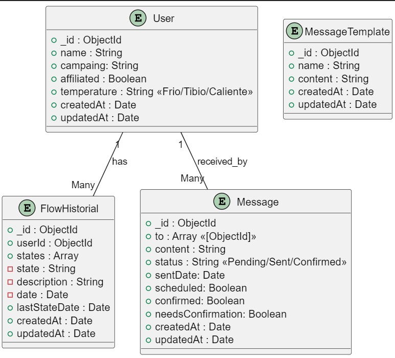

# API de Gestión de Mensajes y Campañas

Esta API permite gestionar usuarios, campañas, historiales de flujo y mensajes, proporcionando herramientas para el seguimiento de usuarios y comunicación personalizada.

---

## Modelo de Datos

El modelo de datos principal utilizado en la API se describe en el siguiente diagrama:

---
